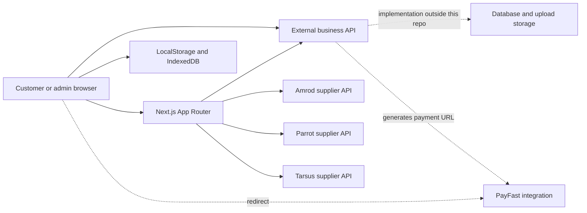

# UGETMORE e-commerce repository assessment

Assessment date: 17 September 2026. Framework: AI-SWE-001, through the `ai-swe-systems` skill created in the referenced Codex task.

## Decision and scope

**This is a substantial e-commerce frontend with an external business backend. It builds successfully, but it is not release-ready or production-ready on the evidence available.** Confirmed security defects and checkout failure handling prevent approval.

Assumed target: **Level 2 — Production**, because the platform handles customer accounts, addresses, orders, payments and customer artwork. Demonstrated state: **MVP-oriented functionality with incomplete MVP safeguards**. No live end-to-end acceptance evidence was available, so even a complete Level 1 baseline is not established. Scale requirements are unknown; there is no evidence justifying a microservice rewrite or Kubernetes.

Reviewed repository: `ugetmoresolutions/ugetmore_application_V2`, branch `main`, commit `d91c2b58f2634e7caf88e5060684fd4c9c692c68`. GitHub remote HEAD matched this commit at assessment time. Inventory: 283 tracked TypeScript/TSX files, approximately 77,097 lines, 42 page files and five API route files. No repository AGENTS.md was found.

Coverage includes repository-wide structure and configuration discovery, targeted source review of security boundaries and commerce workflows, dependency auditing, compilation, linting, type checking, and isolated security probes. This is not a claim that every line or every UI interaction has been exhaustively tested. The separate backend, database, deployed environment, payment callbacks, supplier account permissions, backups and hosting controls were not available for verification. No real checkout, supplier mutation or credential validation was performed.

An existing `package-lock.json` modification was present before review. Checks used that working tree and its installed dependencies, rather than a fresh install of the committed lockfile. The Flowbite plugin rewrote `app/globals.css` during validation; that generated source change was restored afterward. No application fixes, commits, pushes or deployments were made.

## System purpose and architecture

The application serves individual customers, business buyers and administrators. It combines a general storefront with school stationery collections and a more complex branded-merchandise workflow.

| Area | Implemented surface | Important boundary |
| --- | --- | --- |
| Storefront | Landing page, category shops, search/filtering, sorting, pagination, product detail, related products, wishlist | Supplier/aggregated data determines catalog correctness |
| Accounts | Personal/business registration, login, email verification, password reset, profile and addresses | Identity authority is the external backend |
| Commerce | Guest cart, account cart, login merge, quantities, coupons, delivery totals, payment redirect | Browser calculations must remain estimates |
| Branding | Colors, sizes/variants, printing positions and methods, artwork, design requests, previous-job references | Uploaded assets and authoritative pricing need backend validation |
| School shopping | Schools, grades, stationery lists and bulk packs with student information | Student/order data needs explicit ownership and retention rules |
| Order service | Customer order history, admin order management, status changes, mockups, customer feedback and approval | Order state transitions and actor permissions belong on the server |
| Administration | Dashboard, customers/users, products, stock, furniture, branding products, coupons, schools, inquiries, notifications | Admin UI visibility is not permission enforcement |

The stack is Next.js 15.4.10, React 19.1.0 and strict TypeScript, with Tailwind 4, Flowbite, Radix UI components, Framer Motion, Axios and browser storage. There is no database implementation in this repository. Interfaces describe expected payloads, not enforced database schemas.

`app/` defines pages, layouts and supplier proxies; `components/` holds most UI and substantial business orchestration; `hooks/` handles cart, branding and receipt state; `endpoints/rest-api/` wraps backend resources; `services/` and `utils/` transform supplier data, merge carts and manage storage. `interfaces/` and `types/` contain overlapping data models.

The main API URL is `${NEXT_PUBLIC_URL}/api`, falling back to `http://localhost:5000/api` in `endpoints/url.ts`. Browser Axios calls send credentials. Product detail and metadata use the aggregated backend through `utils/server-product-loader.ts`. The supplier proxies run inside Next.js. Amrod/Parrot cache data in module memory; Tarsus uses fetch revalidation. Browser caches have separate expiration policies.

Useful foundations include dedicated resource wrappers, reusable components, loading/empty states, server-rendered product metadata, backend pagination in catalog flows, supplier normalization, and partial-success handling during cart merge. These reduce the work needed to stabilize the platform.

## Prioritized findings

Priorities: P0 requires immediate containment before public exposure; P1 blocks a production release; P2 affects correctness, supportability or maintainability. A confirmed code defect is distinguished from a backend verification requirement.

| ID | Priority | Finding and evidence | Required action |
| --- | --- | --- | --- |
| F01 | P0 | **Supplier credentials committed in source.** `endpoints/lib/token-manager.ts:14` contains Amrod login credentials. A customer feed identifier is embedded in the Parrot route. Credential values are intentionally omitted here. Validity was not tested. | Rotate/revoke exposed credentials with the supplier; move secrets into server-only configuration; inspect relevant access logs and repository history. Removing current text alone does not revoke historical copies. |
| F02 | P0 | **Unauthenticated credential-bearing supplier proxy.** `middleware.ts:15` exempts every API path. `app/api/amrod/[...path]/route.ts:102` and its PUT/DELETE handlers forward caller-selected paths and bodies under the shared supplier bearer token, without local permission checks or an endpoint allowlist. Parrot also forwards multiple methods. | Permit only necessary catalog reads; remove unused mutation methods. Require verified permissions for retained privileged operations, validate payloads, bound request sizes and constrain upstream paths. Actual upstream operations available depend on supplier permissions, which were not exercised. |
| F03 | P1 | **Fabricated JWT payloads satisfy middleware authorization.** `middleware.ts:47` calls `jwtDecode` and trusts `role`/`exp`, with no signature, issuer or audience verification. A local probe accepted a fabricated future-expiring admin token. | Verify session identity at trusted boundaries and enforce every backend permission independently. Use a server-established session or validated JWT. This confirms frontend route-gate bypass, not access to external backend data. |
| F04 | P1 | **Unsafe product HTML rendering.** `ProductTabs.tsx:81` and admin `ProductDetailsModal.tsx:334` inject descriptions directly. `ProductInfo.tsx:522` uses `sanitizeHtmlContent`, but `utils/productStorage.ts:52` only decodes entities. An isolated probe confirmed an HTML event handler survives. | Render plain text or use a maintained allowlist sanitizer consistently, including supplier and admin-authored content. Verify hostile content tests and add an appropriate CSP as defense in depth. Backend sanitization is unknown. |
| F05 | P1 | **Browser-readable token increases the impact of XSS.** `endpoints/lib/ecryptUser.ts:76` explicitly sets `httpOnly: false`; the helper named `encryptToken` performs no encryption. `decryptUser` also logs the token if invoked. | Move authentication secrets into server-set HttpOnly cookies with appropriate scope/lifetime; expose only minimal session data to UI; remove sensitive logging and implement server logout/revocation as needed. |
| F06 | P1 | **Payment failure leaves a blocking modal open.** `CartPage.tsx:168` opens the modal, then awaits `checkout`. `hooks/cart.ts:1064` catches failure and resolves normally; the parent catch never resets its modal state. `PaymentProcessingModal.tsx:19` has a no-op close handler. Cart error state is not rendered in the main page. | Return a typed failure or rethrow; reset state on failure and provide retry/cancel controls. Check response shape before redirecting; constrain payment destinations. Test network errors and rejected payment generation. |
| F07 | P1 | **Unknown price/stock can become purchasable defaults.** `BrandingShopPage.tsx:128` returns stock 999/available when stock metadata is absent. Its pricing helper falls back to `getProductPrice`; `utils/productStorage.ts:100` fabricates a price from minimum quantity or 15.00. Those values can be placed in the cart. | Represent missing commercial data explicitly and disable purchase or request a quote. Reprice and validate stock on the backend before payment. Do not treat unknown availability as inventory. |
| F08 | P1 | **Dependency audit has critical/high findings.** Audit of the working lockfile reports 26 affected package entries: 1 critical, 19 high, 5 moderate, 1 low. Next.js is the critical-rated direct package; `xlsx` is a high-rated direct dependency used by `StationeryManager.tsx`. | Upgrade affected runtime dependencies, assess vulnerable code reachability, and re-run the commerce checks. Review transitive dependency chains. Do not apply audit-proposed downgrades/force fixes blindly. |
| F09 | P2 | **Universal search fallback recurses through stale state.** `UniversalShopPage.tsx:236` sets `useUniversalSearch(false)` then immediately calls the current `fetchFilteredProducts` closure, which still holds `true`. Repeated failures can perpetuate universal requests. The AbortController is also never passed through API wrappers, so it cannot cancel these requests. | Implement explicit primary/fallback functions and pass AbortSignal through Axios/fetch. Guard against stale results and bound retries. Test the universal endpoint failing while the legacy endpoint succeeds. |
| F10 | P2 | **Guest artwork cannot reliably survive reload.** `ProductBranding.tsx:305` creates blob URLs; guest add-to-cart persists them in localStorage at line 831. Upload occurs before adding only for signed-in users. `cartSync.ts:251` later fetches the blob URL. The underlying File is not persisted with that string. | Persist blobs in IndexedDB or use temporary owned uploads and durable references. Test guest artwork → refresh/new session → login → cart merge. Retain the partial-sync recovery behavior. |
| F11 | P2 | **Amrod operational endpoints are misleading.** `amrod-status/route.ts:7` has its own permanently-null cache, so always reports no token. `amrod-clear-cache/route.ts:1` imports the browser HTTP helper instead of the server token manager, calls it without awaiting and reports success. It does not clear the token cache. | Call the real server cache functions, protect management endpoints and verify state changes. The relative server fetch used by the wrong helper normally fails; the reported success is unreliable. |
| F12 | P2 | **Receipts and cart totals disagree on shipping.** Cart uses discounted subtotal for the 2000 threshold (`hooks/cart.ts:701`); `useReceipt.ts:68` uses grand total. With subtotal 1700 and no discount, cart computes 180 shipping + 255 VAT = 2135; receipt then shows zero shipping but keeps total 2135. | Use one authoritative quotation breakdown for cart, payment and documents. Define threshold, rounding, delivery and tax rules once and test their boundaries. This is a code-consistency finding, not a tax-law assessment. |
| F13 | P2 | **Pre-payment documents resemble confirmed order receipts.** `useReceipt.ts:37` generates a local random order ID, includes placeholder company identifiers, and stores the result under the shared `userReceipts` key. It can be invoked from the cart before payment. | Label pre-payment output as a quotation, use approved company details, and issue final receipts from persisted order/payment facts. Scope cached personal data to the user and clear it appropriately on logout. |
| F14 | P2 | **Errors lose their meaning across API layers.** `rest-api-client.ts` returns a mixture of data, Axios responses, error objects and undefined instead of a consistent failure contract. `server-product-loader.ts` turns failures into null; product page turns null/errors into not-found. Supplier routes return raw upstream error text. | Normalize errors/statuses, apply timeouts, avoid exposing upstream internals, distinguish not-found from service failure, and render a retryable outage state. |

Dependency findings are package advisories, not 26 demonstrated exploits. Audit recommends Next 15.5.25 for this dependency graph. Two maintainer advisories were checked: the [Windows-hosted RCE advisory](https://github.com/vercel/next.js/security/advisories/GHSA-p293-qw3h-jr36) applies to affected Windows servers; the [AVIF image optimization advisory](https://github.com/vercel/next.js/security/advisories/GHSA-2xp9-vwfh-vxw4) has image-processing conditions. Production host/platform and image paths must be evaluated rather than assuming every advisory condition applies. Auth0 likewise documents that [jwt-decode does not validate tokens](https://github.com/auth0/jwt-decode).

## Commerce and data integrity boundaries

**Catalog and search.** Multiple category components and supplier adapters coexist. `/client/shop/all` uses the universal search component; `/client/shop/all-products` imports the branding catalog under a different local name, so its route name does not establish universal catalog coverage. Review intended navigation and consolidate contracts before removing duplication. Stock/prices cached for browsing must be refreshed or reserved at checkout. Product metadata and page content perform separate Axios lookups without explicit shared request memoization; supplier/backend outage is currently liable to appear as a 404.

**Cart and pricing.** Guest carts live in browser storage and merge into backend carts after login. Client payloads contain product objects, price, quantities and branding calculations. The payment-generation call sends only userId and couponCode, which can support authoritative backend calculation, but its implementation is absent. It must derive ownership from the authenticated session, load/reprice the cart, revalidate coupons/stock and persist an immutable order snapshot. Browser-stored coupon calculations are convenience state, not proof of entitlement.

**Payment and orders.** The frontend delegates payment generation to `/api/payfast/generate-user-payment`. This repository cannot establish webhook/ITN signature verification, amount/merchant checks, duplicate-notification handling, idempotent payment initiation, stock reservation, reconciliation, refunds or atomic order creation. These are release-blocking verification requirements, not confirmed missing backend features. The interface contains payment states and a simpler fulfillment status model; transition rules must be defined and enforced in the backend. Redirect arrival must not be treated as proof of payment.

**Ownership and files.** Many requests carry userId, adminId, isAdmin, sender and orderId. The backend must derive actors from verified sessions, enforce ownership on every object and ignore client privilege assertions. Audit cross-user cart/order/address access, mockup approval and administrative actions. Validate upload size, content/type, ownership, delivery permissions and retention on the server. Frontend file accept filters alone do not establish safety. Public-looking storage URLs in payloads do not prove the bucket is public or private.

**Required data model evidence.** Obtain actual schemas and constraints for User/Business, Address, Product/Supplier/SKU/Variant, Price, Stock, Cart/CartItem, Coupon/Redemption, Order/OrderItem, Payment/PaymentEvent, School/Grade/Collection, Artwork/DesignRevision and Communication. Confirm foreign keys, unique identifiers, money representation, indexes, ownership, transactional updates, concurrency and deletion/retention policies. None can be verified from TypeScript interfaces alone.

## AI-SWE capability assessment

| Capability | Evidence and assessment |
| --- | --- |
| PC-01 Frontend | Broad feature coverage, responsive classes, reusable dialogs, loading states and product metadata. Failure-state bugs remain; raw HTML is unsafe. Custom artwork dialog has no explicit dialog semantics/focus management and an unnamed icon close button. Keyboard, screen-reader, mobile and visual testing still required. |
| PC-02 Backend/business logic | API wrappers and local supplier proxies exist. Significant orchestration/pricing remains in UI/hooks; authoritative backend rules are outside scope. |
| PC-03 Data architecture | Rich interfaces exist, but no database schema, migration, transaction or retention implementation is present. Browser persistence is untrusted and has artwork/receipt limitations. |
| PC-04 Authentication/authorization | Login/profile UI exists; middleware accepts unverified claims and supplier routes lack local access controls. Blocking. |
| PC-05 Hosting/deployment | Production build/start scripts work. Vercel references are hints, not deployment evidence. No environment guide, deployed HTTPS verification or repeatable release procedure found. |
| PC-06 Cloud/compute | A managed Next.js runtime plus existing business API is a reasonable baseline. Compute, backend storage ownership and operating responsibilities remain undocumented. |
| PC-07 Version control/CI/CD | Git remote and tracked project are available. No tracked CI workflow or automated test suite found. Lint and build pass locally, but important React hook rules are disabled. Branch protection/settings were not inspected. |
| PC-08 Data-level access | Client sends resource and actor identifiers; isolation depends on absent backend code. Requires cross-user/admin negative tests. |
| PC-09 Abuse protection | No local proxy rate limits, body limits or method/path allowlists. Backend login, OTP, uploads and payment limits are unverified. |
| PC-10 Caching/CDN | Browser TTL caches and supplier caches exist. No explicit cross-instance invalidation, cold-start/request coalescing or consistency policy. Revalidate commercial facts at checkout. |
| PC-11 Scalability | Backend pagination helps. Token and supplier caches are instance-local. No load target, latency budget, concurrency evidence or capacity test. Add shared cache/queues only when measured needs justify them. |
| PC-12 Observability | Console diagnostics are frequent, sometimes logging full payloads. No structured correlation, application error tracking, metrics or alert configuration found; token health endpoint is incorrect. |
| PC-13 Availability/recovery | Partial cart-sync recovery exists. Network timeouts and outage distinction are weak; no backup/restore, rollback or recovery evidence for the complete platform. |

Maintainability hotspots include branding product details (3,509 lines), coupons (3,028), grade stationery (2,176), branding creation (1,790), and a 1,404-line shared header. Split responsibilities incrementally around stable domain contracts. The disabled `rules-of-hooks` and dependency checks reduce the value of a clean lint result. Several libraries overlap in UI/carousel/spreadsheet concerns; audit actual imports and dependency weight before removing them.

## Full production readiness gate

Statuses apply to the complete commerce system against the assumed Level 2 target. Missing external evidence is marked incomplete or blocking according to business risk; it does not prove the external control is absent. No item is excused merely because its implementation is not in this repository.

| Required item | Status | Evidence / action to satisfy |
| --- | --- | --- |
| Application architecture | INCOMPLETE | Frontend and boundaries mapped; resolve unsafe proxies and document authoritative commerce rules. |
| Data architecture | BLOCKING | Obtain schemas, money/stock constraints, transaction and concurrency evidence. |
| Authentication | BLOCKING | F03/F05; verified session boundary required. |
| Authorization | BLOCKING | F02/F03; verify backend ownership/admin permissions. |
| Input validation | BLOCKING | Raw HTML and arbitrary proxy payloads; server validation unverified. |
| Secrets management | BLOCKING | F01; rotate exposed credentials and use server-only secrets. |
| API security | BLOCKING | Restrict proxy scope, validate callers, constrain upstream errors and audit dependency reachability. |
| Database security | BLOCKING | Backend access roles and cross-user isolation unavailable. |
| Infrastructure | INCOMPLETE | Identify compute, persistent storage and service owners. |
| Hosting | INCOMPLETE | Build succeeds; deployed runtime not inspected. |
| Environment configuration | INCOMPLETE | Public backend URL silently defaults to localhost; no documented env matrix or fail-fast validation. |
| HTTPS | INCOMPLETE | Deployed transport/cookie configuration unverified. Local tool environment disables Node TLS verification; do not propagate that setting to CI/production. |
| CI/CD | INCOMPLETE | No tracked automated release workflow; establish clean-install checks and controlled release. |
| Testing | BLOCKING | Compilation/lint pass; critical workflow and failure-path regression suite absent. |
| Database migrations | INCOMPLETE | External schema migration and compatibility strategy required. |
| Logging | INCOMPLETE | Replace sensitive/full-payload console logging with redacted contextual events. |
| Monitoring | INCOMPLETE | Define availability, payment, supplier and backend alerts. |
| Error tracking | INCOMPLETE | Add actionable server/browser errors with release identifiers. |
| Rate limiting where necessary | BLOCKING | Public credential-bearing proxy has no local abuse controls; verify backend controls. |
| Performance | INCOMPLETE | Bundle evidence below; no browser field/lab or backend load measurements. |
| Caching where necessary | INCOMPLETE | TTL caching exists; verify freshness, invalidation and multi-instance behavior. |
| Scalability requirements | INCOMPLETE | Establish expected catalog size, users, peak requests and checkout throughput. |
| Backups | INCOMPLETE | Obtain database and customer-upload backup coverage/retention. |
| Restore procedures | INCOMPLETE | Demonstrate a restore into an isolated environment. |
| Availability | BLOCKING | Checkout failure trap and catalog outage-as-404 undermine core flows. |
| Recovery | INCOMPLETE | Define supplier/backend/payment outage recovery and reconciliation. |
| Rollback strategy | INCOMPLETE | Record last-good release, environment rollback and schema compatibility. |

## Validation evidence and limits

| Check | Result |
| --- | --- |
| GitHub remote HEAD | Matches inspected commit. |
| `npm run build` | PASS; optimized production build completed, with 44 static-generation entries. |
| `npm run lint` | PASS under repository configuration; key hook rules are disabled. |
| `node node_modules/typescript/bin/tsc --noEmit --incremental false` | PASS, no diagnostics. |
| Middleware isolated execution | No cookie redirects; fabricated admin cookie allows `/admin/dashboard`; unauthenticated API path allows. Used transpiled source with mocked NextResponse, not a live attack. |
| Sanitizer isolated execution | Event-handler HTML remains unchanged. No browser script execution was attempted. |
| `npm audit --json` | 26 package entries; 1 critical / 19 high / 5 moderate / 1 low. No dependencies changed. |
| Automated functional tests | No tracked test suite/test script found. |
| Browser, PayFast, supplier, restore, deployment and load tests | Not performed; no success claim. |

Build-reported first-load JavaScript: home 188 kB, cart 238 kB, product detail 280 kB, admin school 321 kB, shared baseline 100 kB. These are bundle metrics, not latency or Core Web Vitals measurements. Investigate product interaction cost, spreadsheet/chart imports and image sizing on actual mobile devices before setting performance conclusions.

The build warned that it selected an ancestor lockfile at `C:/Users/dntsi/package-lock.json`, so clean CI should set the intended workspace/tracing root. The installed Flowbite plugin automatically migrated a Tailwind directive during the build; a reproducible build should make that configuration deliberate. The environment also emitted `NODE_TLS_REJECT_UNAUTHORIZED=0`; this was not introduced by this assessment and weakens the transport assurance of local network checks. The audit is therefore reported with that environment limitation.

## Recommended implementation sequence

1. **Contain security exposure.** Rotate supplier credentials, restrict supplier routes, verify sessions, sanitize descriptions and eliminate token logging. Acceptance: anonymous privileged requests and fabricated/expired tokens fail; hostile HTML is inert; no active credentials remain in tracked source.
2. **Make checkout recoverable and authoritative.** Fix the modal/error contract, remove invented stock/prices, reconcile cart/document totals, and verify backend quote/order/payment invariants. Acceptance: payment outages permit retry, price/stock changes are handled explicitly, duplicate initiation/notifications do not duplicate charges/orders, and cross-user access fails.
3. **Establish regression and dependency gates.** Upgrade affected dependencies; add focused integration tests for authentication, proxy permissions, cart merge, guest artwork, coupons, stock/price boundaries, payment failures and order permissions. Run clean install, lint with hook checks, typecheck and build in CI. Preserve existing user lockfile work while reconciling dependencies.
4. **Stabilize catalog and account UX.** Fix search fallback/cancellation, distinguish catalog outages from missing products, replace synthetic receipts with quotations/order-backed documents, and review shared-browser data cleanup. Validate mobile, keyboard and screen-reader paths.
5. **Prove operations.** Document environments, hosting, secrets, logs/alerts and release ownership. Run staging payment tests, failure tests, backup restoration and rollback. Choose capacity targets and load-test them before adding infrastructure.

The next assessment inputs are the backend repository, API specification, staging configuration/test identities, PayFast notification implementation, actual data schemas and operational runbooks. The frontend findings above can be fixed independently while those inputs are gathered.

**Completion classification:** repository assessment complete; development compilation checks passed. Full Feature Done/Development Done for the platform is not established; Release Ready, Production Ready and Operationally Mature are not achieved on current evidence.
